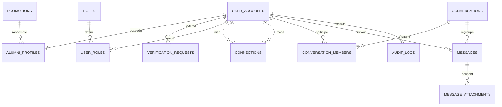

# CSPP Alumni — Schéma de données backend v1

**Statut : proposition à valider avant implémentation**  
**Portée du lot : identité, vérification, rôles, réseau et messagerie.**

## 1. Principes de conception

Le modèle sépare explicitement **le compte**, **le profil**, **le statut de vérification** et **les rôles**. Cette séparation permet d’ouvrir le réseau en lecture dès la création du compte, tout en bloquant de façon fiable les interactions tant que le statut n’est pas `verified`.

Les données d’identité et les permissions sont contrôlées côté serveur. Une interface peut afficher ou masquer une action, mais chaque création, modification ou suppression doit faire l’objet d’une autorisation serveur indépendante.

| Décision | Règle retenue |
| --- | --- |
| Identifiant primaire | UUID généré côté serveur pour toutes les entités métier. |
| Horodatage | `created_at` et `updated_at` sur les données modifiables ; UTC en base. |
| Suppression | Archivage logique avec `deleted_at` pour les contenus et comptes sensibles. |
| Badge bleu | Dérivé uniquement de `account.status = verified` ; jamais stocké comme booléen indépendant. |
| Mentor | Rôle complémentaire, activé automatiquement lorsqu’un alumni vérifié active sa disponibilité. |
| Permissions | Vérifiées à chaque mutation côté API, avec journalisation des actions sensibles. |

## 2. Statuts fondamentaux

### Compte

| Valeur | Effet produit |
| --- | --- |
| `pending_verification` | Consultation du réseau et gestion du profil personnel ; aucune interaction sociale ou transactionnelle. Libellé « En cours de validation ». |
| `verified` | Interactions complètes autorisées ; badge bleu de certification affiché. |
| `rejected` | Consultation maintenue ; interactions bloquées ; possibilité de soumettre de nouveaux justificatifs. |
| `suspended` | Accès bloqué, à l’exception du support ou du parcours de recours selon politique. |
| `deactivated` | Compte fermé par son titulaire ou administrateur ; profil retiré de l’annuaire. |

### Connexion entre alumni

| Valeur | Effet produit |
| --- | --- |
| `pending` | Invitation envoyée, sans messagerie directe. |
| `accepted` | Connexion active ; messagerie directe et interactions liées autorisées. |
| `declined` | Invitation refusée ; historique minimum conservé pour éviter le spam. |
| `blocked` | Toute interaction entre les deux comptes est interrompue. |

### Vérification

| Valeur | Sens |
| --- | --- |
| `submitted` | Justificatifs envoyés, en attente de revue. |
| `needs_information` | Informations ou pièce complémentaire demandée. |
| `approved` | Vérification acceptée ; le compte devient automatiquement `verified`. |
| `rejected` | Vérification refusée, motif communiqué au titulaire. |

## 3. Entités et relations

### 3.1 `user_accounts`

Cette table représente l’identité de connexion et le statut de sécurité ; elle ne contient pas les informations éditoriales de profil.

| Champ | Type indicatif | Règle |
| --- | --- | --- |
| `id` | UUID, PK | Identifiant interne immuable. |
| `email` | texte, unique | Normalisé et vérifié avant activation. |
| `password_hash` | texte nullable | Nul lorsque l’authentification repose exclusivement sur un fournisseur tiers. |
| `status` | enum | `pending_verification`, `verified`, `rejected`, `suspended`, `deactivated`. |
| `email_verified_at` | timestamp nullable | Preuve de contrôle de l’adresse e-mail. |
| `verified_at` | timestamp nullable | Défini lors de l’approbation administrative. |
| `last_login_at` | timestamp nullable | Suivi de sécurité et activité. |
| `created_at`, `updated_at` | timestamp | Horodatages système. |

### 3.2 `alumni_profiles`

| Champ | Type indicatif | Règle |
| --- | --- | --- |
| `user_id` | UUID, PK/FK | Référence unique vers `user_accounts.id`. |
| `first_name`, `last_name` | texte | Données affichées selon la préférence de visibilité. |
| `promotion_id` | UUID, FK nullable | Promotion CSPP associée au profil. |
| `headline`, `organization`, `job_title` | texte nullable | Informations professionnelles. |
| `bio`, `location`, `avatar_storage_key` | texte nullable | Informations de profil facultatives. |
| `directory_visibility` | enum | `network`, `promotion_only`, `private`. |
| `mentor_available` | booléen | Déclenche l’activation du rôle Mentor si le compte est vérifié. |
| `mentor_topics` | JSONB / table liée | Domaines d’accompagnement ; préférer une table liée si recherche avancée. |

### 3.3 `promotions`

| Champ | Type indicatif | Règle |
| --- | --- | --- |
| `id` | UUID, PK | Identifiant interne. |
| `year` | entier, unique | Année de promotion CSPP. |
| `label` | texte | Libellé éditorial optionnel. |
| `is_active` | booléen | Évite la suppression d’une promotion ayant des membres. |

### 3.4 Vérification et rôles

| Table | Champs essentiels | Règle métier |
| --- | --- | --- |
| `verification_requests` | `id`, `user_id`, `status`, `submitted_at`, `reviewed_by`, `reviewed_at`, `decision_reason` | Conserver l’historique des demandes ; une seule demande active par alumni. |
| `verification_documents` | `id`, `verification_request_id`, `storage_key`, `mime_type`, `original_name`, `uploaded_at` | Fichiers privés, accessibles aux seuls administrateurs habilités. |
| `roles` | `id`, `code`, `label` | Valeurs initiales : `alumni`, `mentor`, `moderator`, `administrator`. |
| `user_roles` | `user_id`, `role_id`, `assigned_by`, `assigned_at`, `revoked_at`, `reason` | Le rôle `alumni` est attribué à création. `mentor` est ajouté automatiquement à disponibilité active d’un compte vérifié. |

## 4. Réseau, messagerie et pièces jointes

### 4.1 `connections`

| Champ | Type indicatif | Règle |
| --- | --- | --- |
| `id` | UUID, PK | Identifiant interne. |
| `requester_id`, `recipient_id` | UUID, FK | Deux comptes distincts et vérifiés. |
| `status` | enum | `pending`, `accepted`, `declined`, `blocked`. |
| `created_at`, `responded_at` | timestamp | Cycle de vie de l’invitation. |

Une contrainte empêche les doublons dans les deux sens. Une requête de connexion est autorisée seulement si les deux comptes ont le statut `verified`.

### 4.2 Conversations et messages

| Table | Champs essentiels | Règle métier |
| --- | --- | --- |
| `conversations` | `id`, `kind`, `created_by`, `created_at`, `last_message_at`, `archived_at` | `kind` : `direct` ou `group`. Une conversation directe ne peut exister qu’une fois pour une paire d’alumni. |
| `conversation_members` | `conversation_id`, `user_id`, `joined_at`, `left_at`, `last_read_message_id`, `muted_at` | Contrôle l’accès à la conversation et les compteurs de non-lus. |
| `messages` | `id`, `conversation_id`, `sender_id`, `body`, `kind`, `reply_to_id`, `sent_at`, `edited_at`, `deleted_at` | `kind` : `text`, `attachment`, `voice`, `system`. L’émetteur doit être vérifié et membre de la conversation. |
| `message_attachments` | `id`, `message_id`, `storage_key`, `original_name`, `mime_type`, `size_bytes`, `duration_ms`, `thumbnail_key` | Un enregistrement par fichier ; une pièce jointe reste privée et accessible seulement aux membres. |

La création d’une conversation directe est autorisée uniquement entre deux comptes vérifiés qui possèdent une connexion `accepted`, sauf règle produit ultérieure contraire. Le statut de membre doit être vérifié pour toute lecture, écriture ou consultation de pièce jointe.

## 5. Contraintes, index et audit

| Élément | Contrainte ou index |
| --- | --- |
| Comptes | Index unique sur `email` ; index sur `status` pour les files de validation. |
| Profils | Index sur `promotion_id`, `directory_visibility`, `mentor_available`, et recherche plein texte sur nom / poste / organisation. |
| Vérifications | Index composite sur `(status, submitted_at)` pour l’administration ; unicité de la demande active par `user_id`. |
| Connexions | Unicité sur la paire non ordonnée de comptes ; index sur `recipient_id, status`. |
| Conversations | Unicité de la paire de membres pour `kind = direct` ; index sur `last_message_at`. |
| Messages | Index sur `(conversation_id, sent_at DESC)` et `(sender_id, sent_at DESC)`. |
| Pièces jointes | Index sur `message_id` et `storage_key`; validation serveur de la taille et du type MIME. |

### `audit_logs`

Les opérations sensibles génèrent un journal non modifiable.

| Champ | Description |
| --- | --- |
| `id`, `occurred_at` | Identifiant et horodatage. |
| `actor_id`, `actor_role` | Auteur et rôle utilisé. |
| `action`, `entity_type`, `entity_id` | Action et ressource concernée. |
| `before`, `after` | État minimal avant / après, en excluant le contenu privé non nécessaire. |
| `reason`, `request_id`, `ip_hash` | Justification, traçabilité technique et corrélation. |

## 6. Déclencheurs métier à prévoir

| Événement | Effet atomique attendu |
| --- | --- |
| Approbation d’une vérification | `verification_request.status = approved`, `user_accounts.status = verified`, `verified_at` renseigné, journal créé, notification programmée. |
| Refus ou complément demandé | Compte reste non interactif ; motif et prochaine action visibles pour l’alumni. |
| Passage de `mentor_available` à vrai | Si le compte est vérifié, créer ou réactiver `user_roles.mentor` automatiquement. |
| Compte vérifié qui désactive sa disponibilité | Révoquer le rôle Mentor ou le rendre inactif ; conserver l’historique. |
| Suspension de compte | Bloquer les nouvelles sessions et mutations ; conserver les contenus selon la politique de rétention. |
| Retrait définitif de contenu | Décision Administrateur, motif, audit et notification de l’auteur. |

## 7. Questions de validation avant la base de données

| Question | Proposition par défaut |
| --- | --- |
| Un alumni refusé peut-il re-soumettre une vérification ? | Oui, après correction ou ajout des justificatifs demandés. |
| Les événements nécessitent-ils une inscription réservée aux vérifiés ? | Oui : visibilité publique au réseau, inscription et annulation uniquement pour les comptes vérifiés. |
| La suppression d’un compte entraîne-t-elle l’anonymisation des messages ? | Oui, après expiration d’un délai de conservation à définir ; les conversations restent techniquement cohérentes. |
| Souhaitez-vous dès v1 les conversations de groupe ? | Modèle prévu, activation fonctionnelle à confirmer ; la messagerie directe peut démarrer seule. |
| Quelle taille maximale par fichier ? | Valeur initiale proposée : 25 Mo par pièce jointe, à ajuster selon le coût de stockage. |
